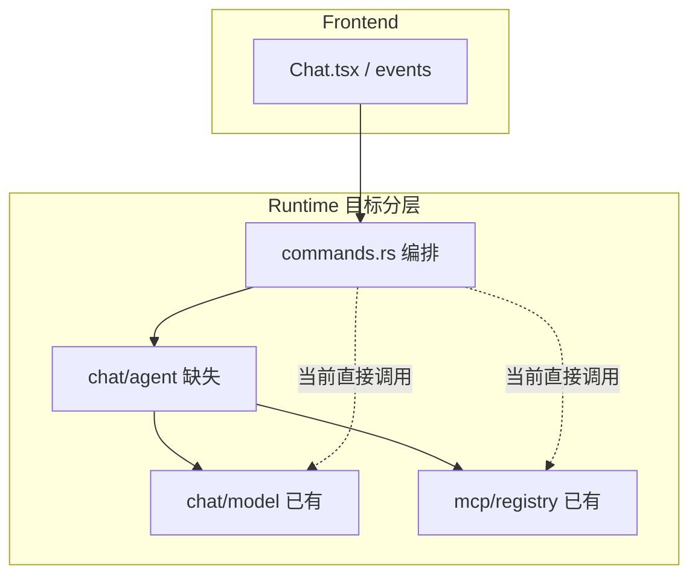
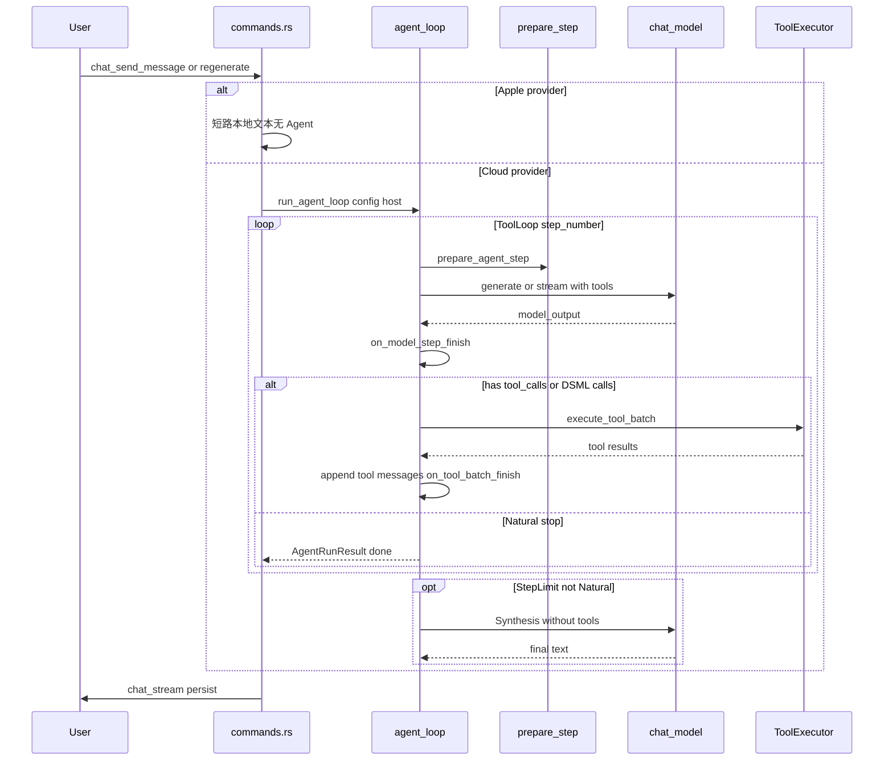
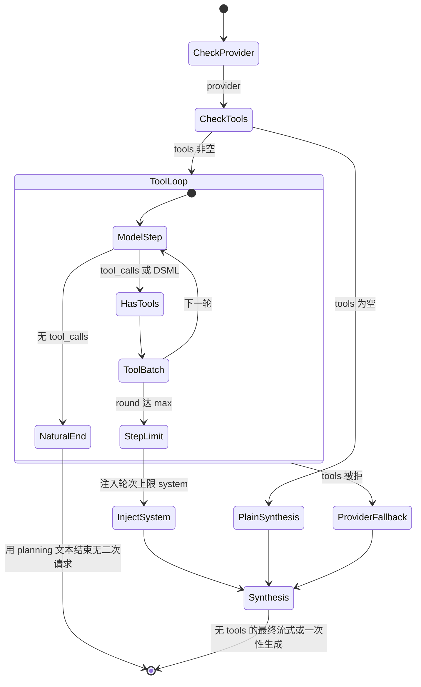

# PRD：Kivio Chat Agent Runtime 标准化

| 字段 | 内容 |
|------|------|
| 文档版本 | v1.1 |
| 状态 | 已评审（可进入 Phase B） |
| 产品 | Kivio（桌面端，macOS / Windows） |
| 范围 | **Chat Agent 编排层**（`src-tauri/src/chat/agent/` 目标模块）；不含 Lens、不含第三方连接器（Composio 等） |
| 目标读者 | 产品、Rust/前端研发、测试 |
| 用户可感知变化（Phase B） | **无** — 仅后端重构与可测性提升 |
| 关联文档 | [CHAT_ARCHITECTURE.md](./CHAT_ARCHITECTURE.md)（v1.1）、[.trellis/spec/frontend/type-safety.md](../.trellis/spec/frontend/type-safety.md)、[06-04-normalize-chat-runtime-framework](../.trellis/tasks/06-04-normalize-chat-runtime-framework/prd.md)、[06-04-chat-optimization-prd](../.trellis/tasks/06-04-chat-optimization-prd/prd.md) |

### 修订记录

| 版本 | 日期 | 说明 |
|------|------|------|
| v1.0 | 2026-06-04 | 初稿 |
| v1.1 | 2026-06-04 | 评审修订：状态机、Step/on_finish 时点、regenerate/Apple、AgentHost 依赖、冒烟扩充、Phase A 完成态 |

---

## 1. 背景与问题陈述

Kivio Chat 已完成 **Model 层** 的 Provider 抽象（`chat/model`：`LanguageModelProvider`、`GenerateRequest`、`StreamPart`，支持 OpenAI Chat、Anthropic Messages、Apple 本地）。多轮工具调用、流式输出、审批、MCP/Skill/内置工具、以及 `model_messages` / `api_messages` 双轨持久化均已上线。

然而 **Agent 编排层**（何时停步、每步如何准备上下文、如何执行工具、如何合成最终回复）仍集中在 [`src-tauri/src/chat/commands.rs`](../src-tauri/src/chat/commands.rs)（约 5300 行），核心函数 `complete_assistant_reply` 内含：

- 工具多轮循环（`max_tool_rounds`）
- Planning 流式（`ChatStreamFinishPolicy::WhenNoToolCalls`）
- 与 Synthesis 流式（无 tools 的最终回答）两条路径
- Skill / Assistant preset / Provider 降级等分散逻辑

上述逻辑同时服务于 **`chat_send_message`** 与 **`chat_regenerate_message`**（均调用 `complete_assistant_reply`）。

这带来：

1. **可维护性**：难以单独为 tool loop 写 characterization tests；新增能力（并行 tool、上下文压缩）易引入回归。
2. **概念不一致**：团队内部缺少标准化的循环控制词汇（Step、stopWhen、prepareStep），沟通与协作成本高。
3. **扩展性**：暂缓「连接器」类产品时，仍需稳定的 **ToolExecutor** 边界，避免未来 MCP/连接器接入时重写循环。

本 PRD 定义 **Chat Agent Runtime** 的标准化目标、架构与分阶段交付，**不引入** npm `ai` / Vercel AI SDK 运行时依赖，采用 AI SDK 文档认可的 **Manual Loop Control**（Rust 侧外置工具执行）。

---

## 2. 目标与非目标

### 2.1 产品与技术目标

| ID | 目标 | 说明 |
|----|------|------|
| G1 | **编排可模块化** | Agent 循环迁入 `chat/agent/`，`commands.rs` 变薄 |
| G2 | **语义清晰** | 内部 API 采用标准循环控制术语：`Step`、`stopWhen`、`prepareStep`、`onStepFinish` |
| G3 | **行为零回归（Phase B）** | 用户可见流式、工具卡片、审批、持久化格式不变 |
| G4 | **工具边界清晰** | `ToolExecutor` trait；native/skill/mcp 实现可插拔 |
| G5 | **可测可回归** | Agent loop 具备 Rust 单测 + 发版冒烟场景清单 |
| G6 | **入口一致** | send 与 regenerate 共用同一 Agent 路径（Apple 除外） |

### 2.2 成功指标（Phase B 建议）

| 指标 | 目标 |
|------|------|
| `commands.rs` 中 tool-loop 相关逻辑迁出 | 净减少 ≥ 400 行（以 PR diff 为准） |
| `chat/agent/` 单测 | ≥ 3 个 characterization tests + 既有测试全绿 |
| 冒烟 | §10.2 P0 场景 100% |
| 额外模型请求 | Phase B 相对现网 **0 次** 增加 |

### 2.3 非目标（本 PRD 不做）

- 第三方 **连接器**（Composio、托管 OAuth 连接市场）及对应设置页
- 在 Tauri 前端或 Node sidecar 中运行 **Vercel AI SDK**（`generateText` / `streamText`）
- Lens 截图问答流程改造
- 存储方案迁移（仍为每对话 JSON）
- 多 Agent 协作、自主规划 UI

### 2.4 与并行任务的分工

| 任务/模块 | 职责 |
|-----------|------|
| [normalize-chat-runtime-framework](../.trellis/tasks/06-04-normalize-chat-runtime-framework/prd.md) | **Model 层**：Provider 适配、SSE 解析、`GenerateRequest` |
| **本 PRD（Agent Runtime）** | **编排层**：tool loop、step、prepare/stop/finish、与 Tauri 事件衔接 |
| [chat-optimization-prd](../.trellis/tasks/06-04-chat-optimization-prd/prd.md) | **产品体验**：稳定性、内置工具文案、冒烟清单 |

---

## 3. 设计原则

1. **Manual Loop（外置工具执行）**  
   模型只产出 `tool_calls`；执行、审批、超时在 Rust `ToolExecutor` 完成。不采用「工具内置 `execute` + SDK 自动循环」的模式。

2. **Provider 与 Agent 分离**  
   Runtime 只通过 `LanguageModelProvider::generate/stream` 调模型；禁止在 Agent 模块内拼装 OpenAI `choices` 或 Anthropic `content` 块。

3. **事件契约稳定**  
   `chat-stream`、`chat-tool`、`chat-tool-confirm`、`chat-context` payload 不变；Agent 仅在边界转换 `StreamPart`。

4. **行为兼容优先**  
   Phase B 以「零行为 diff 抽取」为主；合并 planning/synthesis 为单一路径属 Phase C 可选优化。

5. **桌面增强保留**  
   取消（`run_generation`）、敏感工具审批、DSML 解析、双阶段流式（planning 不在有 tool 时误发 `done`）均为一等需求。

6. **无循环依赖**  
   `chat/agent` **不得** `use` 或依赖 `chat/commands.rs`。Tauri emit、审批、取消检查通过 **`AgentHost` trait**（由 `commands` 在调用 `run_agent_loop` 时注入）完成。

---

## 4. 现状与差距

### 4.1 已有能力（As-Is）

| 能力 | 代码位置 | 说明 |
|------|----------|------|
| Provider 抽象 | `src-tauri/src/chat/model/` | `OpenAiChatProvider`、`AnthropicMessagesProvider` |
| 跨层契约 | `.trellis/spec/frontend/type-safety.md` | Provider + MCP/Skill + **Chat Agent Runtime** 场景 |
| 架构文档 | `docs/CHAT_ARCHITECTURE.md` v1.1 | Model/Agent 分层、消息流已更新 |
| 工具注册/调用 | `src-tauri/src/mcp/registry.rs` | `list_enabled_tool_defs`、`call_tool`（native/skill/mcp） |
| 多轮工具循环 | `commands.rs` → `complete_assistant_reply` | `max_tool_rounds`、无 `tool_calls` 即结束 planning |
| 流式策略 | `ChatStreamFinishPolicy` | Planning：`WhenNoToolCalls`；Synthesis：`Always` |
| 隐藏 transcript | `ChatMessage.model_messages` / `api_messages` | UI 不展示 `role: tool` 时间线 |
| DSML | `src-tauri/src/chat/dsml_tools.rs` | DeepSeek 等 markup → `PendingToolCall` |
| 双入口 | `chat_send_message`、`chat_regenerate_message` | 均走 `complete_assistant_reply` |

### 4.2 差距（Gap）



| # | 差距 | 影响 |
|---|------|------|
| 1 | 无 `chat/agent` 模块 | 循环与 context 压缩、附件逻辑耦合，难测 |
| 2 | 无 `AgentStep` / `AgentRun` 类型 | 无法表达 `steps[]` 与 `onStepFinish` 语义 |
| 3 | `prepareStep` 逻辑分散 | Skill/Assistant/降级/轮次上限 system 散落 |
| 4 | Planning / Synthesis 双入口 | 需 `AgentPhase` + §6.1 状态机文档化 |
| 5 | 同 step 多 tool 串行 | 延迟高于同 step 并行 execute |
| 6 | 无 `ToolExecutor` / `AgentHost` trait | 扩展与测试替身困难 |
| 7 | Agent loop 单测不足 | 回归依赖手工冒烟 |
| 8 | 无 `AgentHost`，抽取易引入 commands↔agent 循环依赖 | 编译失败或隐性耦合 |

### 4.3 与 Vercel AI SDK 的关系

AI SDK 提供两条路：

- **托管循环**：`stopWhen` + `prepareStep` + 可选 `tools.execute`
- **手动循环**：[Manual Loop Control](https://ai-sdk.dev/docs/agents/loop-control)

**Kivio 选择手动循环**，并在 Rust 实现等价语义：

| AI SDK | Kivio（目标） |
|--------|----------------|
| `stepCountIs(n)` | `max_tool_rounds` + `AgentStopReason::StepLimit` |
| `prepareStep({ stepNumber, steps, messages })` | `prepare_agent_step(...)` |
| `onStepFinish`（含 tool results） | `on_model_step_finish` + `on_tool_batch_finish` → 合并为 `AgentStepResult` |
| `result.response.messages` | `step.response_messages` → `runtime_messages` |
| `tools.execute` | `ToolExecutor::call`（外置） |
| 最后一 step 无 tools | `AgentPhase::Synthesis`（`step_number` 仍递增） |

---

## 5. 目标架构

### 5.1 模块结构（目标）

```
src-tauri/src/chat/
  mod.rs
  commands.rs          # Tauri 命令、会话 IO、实现 AgentHost、调用 run_agent_loop
  agent/
    mod.rs
    types.rs           # AgentRunConfig, AgentStepResult, AgentStopReason, AgentPhase
    host.rs            # AgentHost trait（emit、审批、cancel、generation）
    loop.rs            # run_agent_loop
    prepare.rs         # prepare_agent_step
    stop.rs            # evaluate_stop, step_limit_system_message
    execute.rs         # execute_tool_batch（审批、超时、可选并行）
    stream.rs          # AgentStreamPolicy, StreamSink 适配
  model/               # 已有
  dsml_tools.rs
  storage.rs
  types.rs
```

### 5.2 运行时数据流（修正版）



### 5.3 层次边界

| 层 | 输入 | 输出 | 禁止 |
|----|------|------|------|
| **commands** | 用户消息、conversation、`AgentHost` 实现 | 持久化、Tauri 事件 | 在 tool loop 内直接拼 Provider JSON |
| **agent** | `AgentRunConfig` + `&dyn AgentHost` | `AgentRunResult`、`tool_records` | `use crate::chat::commands`；直接 spawn MCP |
| **model** | `GenerateRequest` | `GenerateOutput`、`StreamPart` | 调用工具、写 conversation 文件 |
| **ToolExecutor** | `ModelTool` + args + `ToolExecutionContext` | `McpToolCallResult` | 调用 LLM、emit 事件 |

---

## 6. 核心概念（词汇表）

| 术语 | 定义 |
|------|------|
| **AgentRun** | 一次 `complete_assistant_reply` 触发的完整助手生成（send 或 regenerate） |
| **AgentRunEntry** | `Send` \| `Regenerate` — 影响标题生成等边际逻辑，**不**改变 tool loop 核心 |
| **ModelStep** | 单次 LLM 调用（ToolLoop 或 Synthesis 相别由 `AgentPhase` 标注） |
| **ToolBatch** | 单个 ModelStep 内 0..n 个 `tool_call` 的执行（含审批、超时） |
| **AgentStepResult** | 一个 `step_number` 的完整记录 = ModelStep + ToolBatch + 合并后的 `response_messages` |
| **AgentPhase::ToolLoop** | 请求带 `tools`；流式 `PlanningNoDoneUntilNoTools` |
| **AgentPhase::Synthesis** | 请求 **无** `tools`；流式 `SynthesisAlwaysDone`；在日志/metrics 中单独标记 phase，但 **`step_number` 仍递增**（`prepareStep(stepNumber)` 的步号递增语义） |
| **AgentPhase::Plain** | `active_tools` 为空且未启用 tool loop（等同现网跳过 `if !tools.is_empty()`） |
| **AgentStopReason::Natural** | 经 `extract_tool_calls` **与** `pending_tool_calls_from_dsml` 均为空；结束 ToolLoop，若有可见 assistant 文本则 **不再** 发起 Synthesis |
| **AgentStopReason::StepLimit** | ToolLoop 轮次用尽且未 Natural；注入 system 后进入 Synthesis |
| **AgentStopReason::Cancelled** | `run_generation` 失效或用户取消 |
| **AgentStopReason::ProviderToolsUnsupported** | Provider 拒绝 tools 且 fallback 耗尽 |
| **prepare_agent_step** | 每 **ModelStep** 前：active_tools、messages/system、phase、stream_policy |
| **on_model_step_finish** | LLM 返回后：流式收尾策略、记录 model 输出、**尚未** 写 tool 结果 |
| **on_tool_batch_finish** | ToolBatch 完成后：追加 `role: tool` 消息、更新 `AgentStepResult` |
| **AgentHost** | 注入的 emit/审批/cancel 能力，替代 agent 对 commands 的直接依赖 |
| **response_messages** | 本 step 写入 transcript 的增量（assistant + tool） |

### 6.1 Agent 运行状态机（与现网一致）



| 现网分支 | 状态机节点 | 模型请求次数要点 |
|----------|------------|------------------|
| `tools.is_empty()` | PlainSynthesis → Synthesis | 无 ToolLoop，直接 Synthesis |
| ToolLoop 内无 tool_calls | NaturalEnd | **不** 再 Synthesis（场景 5） |
| `round >= max` 且无 Natural | StepLimit → Synthesis | 多一次无 tools 请求 |
| `provider_tools_unsupported` | ProviderFallback → Synthesis | 改 system 后 Synthesis |

---

## 7. 功能需求

### FR-01 Agent 模块抽取

从 `complete_assistant_reply` 抽出 `run_agent_loop`：

- 调用方：`chat_send_message`、`chat_regenerate_message` 均经 `complete_assistant_reply` → `run_agent_loop`
- `commands.rs` 保留：context 估算/压缩、附件、标题生成、`push_assistant_message`、**`AgentHost` 实现**

**验收**：

- `commands.rs` 行数显著下降（见 G6 指标）
- regenerate 与 send 共用 `run_agent_loop`，冒烟 §10.2 #11 通过

### FR-02 Step 模型

定义（Rust，示意）：

- `AgentRunConfig`：`entry: AgentRunEntry`、`conversation_id`、`run_id`、`message_id`、`generation`、`provider`、`model`、`all_tools`、`settings` 快照、`stream_enabled`、`last_user_image_paths` 等
- `AgentStepResult`：`step_number`、`phase`、`model_output`、`tool_records`、`response_messages`、`streamed`、`stop_reason: Option<AgentStopReason>`

**验收**：`Vec<AgentStepResult>` 供 `prepare_agent_step` 读取；Synthesis 步 `step_number` 递增且 `phase == Synthesis`。

### FR-03 stopWhen 策略

`evaluate_stop_after_model_step` / `evaluate_stop_after_tool_loop` 实现 §6.1 转移条件。

**验收**：§10.2 场景 4、5、7、10。

### FR-04 prepare_agent_step

收拢：`apply_assistant_tool_preset`、`apply_active_skill_tool_filter`、`chat_tools_capable`、skill-only、`apply_skill_fallback_when_tools_unavailable`。

返回 `PreparedStep { active_tools, runtime_messages, system_prompt, phase, stream_policy }`。

- `phase == Plain` 当无可用 tools 或 tool loop 未进入
- （Phase D）message 截断 / context 压缩

**验收**：`commands.rs` 无上述 filter 重复链。

### FR-05 on_step_finish（两阶段）

1. **`on_model_step_finish`**：记录 model 输出；Planning 流式下按 `AgentStreamPolicy` 决定是否 `emit_chat_stream_done`；**不** 写入 tool 结果。
2. **`on_tool_batch_finish`**：追加 tool `role: tool` 消息；合并进 `AgentStepResult.response_messages`；工具事件已在 execute 路径发出。

**验收**：单 tool 失败不破坏已完成 ModelStep 的 assistant 消息；transcript 顺序与现网一致。

### FR-06 ToolExecutor 与 AgentHost

```rust
// 示意
pub struct ToolExecutionContext<'a> {
    pub conversation_id: &'a str,
    pub run_id: &'a str,
    pub message_id: &'a str,
    pub generation: u64,
    pub round: u8,
    // 不持有 AppHandle；通过 AgentHost 回调
}

#[async_trait::async_trait]
pub trait ToolExecutor {
    async fn call(
        &self,
        host: &dyn AgentHost,
        ctx: &ToolExecutionContext<'_>,
        tool: &ModelTool,
        arguments: serde_json::Value,
        skill_cache: &mut skills::SkillRunCache,
    ) -> Result<McpToolCallResult, String>;
}

pub trait AgentHost: Send + Sync {
    fn emit_tool_record(&self, ...);
    async fn request_tool_approval(&self, ...) -> bool;
    fn is_generation_active(&self, conversation_id: &str, generation: u64) -> bool;
    // 其它 emit_stream_delta / emit_stream_done 等
}
```

- `RegistryToolExecutor` 委托 `mcp::registry::call_tool`
- 单测使用 `MockToolExecutor` + `MockAgentHost`

**验收**：`agent/` 无 `commands` 依赖；`execute.rs` 不 import MCP client 具体类型。

### FR-07 流式策略内聚

- `PlanningNoDoneUntilNoTools`
- `SynthesisAlwaysDone`
- DSML 缓冲：`stream.rs` 或复用 `ChatTauriStreamSink`

**验收**：Planning 有 tool_calls 时不 premature `done`；非流式 `stream_enabled == false` 时 reasoning 行为与现网一致（§10.2 #12）。

### FR-08 行为不变承诺

与 [type-safety.md](../.trellis/spec/frontend/type-safety.md) 及现网一致：

- Tauri 事件 payload
- `model_messages` / `api_messages` 持久化
- 审批、`merge_reasoning`
- **Apple**：`provider_is_apple` 时在 `commands` **短路**，不进入 `run_agent_loop`；无图、无 tools
- **多模态**：`last_user_image_paths` 在 Synthesis（及 ToolLoop 中若现网传入）行为不变

**验收**：§10.2 全部场景。

### FR-09 并行 tool（Phase C，可选）

`chatTools.parallelToolCallsInStep` 默认 **false**；审批 per-call；tool 结果按 `tool_call_id` 排序写回。

### FR-10 测试与文档

| 项 | Phase A（已完成） | Phase B |
|----|-------------------|---------|
| 本 PRD | v1.1 | — |
| CHAT_ARCHITECTURE Agent 节 | 已更新 | — |
| type-safety Agent 场景 | 已添加 | 随实现细化 |
| `chat/agent/` 代码与单测 | — | 必须 |

**验收**：`cargo test` 全通过；§10.1 checklist 完成。

---

## 8. 非功能需求

| 类别 | 要求 |
|------|------|
| **性能** | Phase B 不增加模型请求；Phase C 并行不增加请求次数 |
| **可靠** | 单 tool 失败不拖垮 Run；与现 `execute_chat_tool_call` 一致 |
| **安全** | 审批、路径、denylist 留在 execute 路径 |
| **兼容** | 旧对话 replay `api_messages` fallback |
| **可维护** | `loop.rs` 建议 &lt; 400 行 |
| **可观测** | 每 ModelStep 一行日志：`step_number`、`phase`、`tool_count`、`duration_ms` |

---

## 9. 分阶段交付

| 阶段 | 内容 | 产出 | 完成定义 |
|------|------|------|----------|
| **A — 规范** | PRD、架构文档、spec 场景 | PRD v1.1、CHAT_ARCHITECTURE v1.1、type-safety Agent 场景 | [x] 文档就绪（本版本） |
| **B — 抽取** | `chat/agent/*` + `AgentHost` + `run_agent_loop` | PR；建议拆 2 个 PR：① types/prepare/stop/host ② loop 接线 | §10 P0 100%；G6 指标 |
| **C — 体验** | 并行 tool；可选流式 tool UI；可选统一 step 路径 | 设置项、测试 | 并行关=现行为 |
| **D — 上下文** | prepare 内对接 context 压缩 | 长对话稳定 | 与 context 任务联调 |

**Phase B 启动门控（Gate）**：§12.2 normalize 检查表四项均为真，或已记录明确例外。

**建议排期**：B（1.5–2 周）→ C（可选 0.5–1 周）→ D。

---

## 10. 验收标准

### 10.1 自动化

- [ ] `cargo test --manifest-path src-tauri/Cargo.toml` 全通过
- [ ] `npm run typecheck` / `npm run lint` 无新增错误
- [ ] `agent/` ≥ 3 单测：Natural 无二次 Synthesis、StepLimit system 注入、prepare skill 过滤
- [ ] 单测可使用 `MockToolExecutor` / `MockAgentHost`

### 10.2 手工冒烟（P0）

| # | 场景 | 预期 |
|---|------|------|
| 1 | 纯文本流式，tools 关闭 | 正常 delta + done（Plain → Synthesis） |
| 2 | 单轮 `web_search` | 1 次 tool 卡片 + 最终回答 |
| 3 | 多轮 tool 至模型不再调用 | 轮次 ≤ `max_tool_rounds` |
| 4 | 达到 `max_tool_rounds` | system 提示后仍有 synthesis 正文 |
| 5 | Planning 返回纯文本无 tool_calls | **不**再发起 Synthesis |
| 6 | 流式中取消 | `cancelled`，无串台 |
| 7 | Provider 不支持 tools | skill-only 或 plain fallback |
| 8 | `write_file` 审批拒绝 | skipped，助手知晓 |
| 9 | DeepSeek DSML 输出 | 解析为 tool 并执行 |
| 10 | `chat_tools.enabled` 但无可用 tool 定义 | 等同 Plain，不崩溃 |
| 11 | **重生成**最后一条 assistant | 与 send 行为一致，工具/流式正常 |
| 12 | **非流式**（`stream_enabled: false`） | 仍有完整正文与 tool 卡片；reasoning 行为与现网一致 |

### 10.3 代码结构（Phase B）

- [ ] `src-tauri/src/chat/agent/loop.rs` 导出 `run_agent_loop`
- [ ] `agent/` 不依赖 `commands.rs`
- [ ] `ToolExecutor` + `AgentHost` 已用
- [ ] Apple 短路仍在 `commands`（不进入 agent）

---

## 11. 风险与开放问题

| 风险 | 缓解 |
|------|------|
| 流式边界回归 | §10.2 #5、#6、#12；Phase B 零行为 diff |
| commands↔agent 循环依赖 | 强制 `AgentHost`；CR 检查 `agent` 的 use 树 |
| PR 过大 | B 拆两 PR：基础设施 → loop 接线 |
| normalize 未完成 | §12.2 Gate；Anthropic 仍依赖 commands 则暂缓 B |
| regenerate 漏测 | §10.2 #11 |
| Planning/Synthesis 合并 | 仅 Phase C；默认双路径 |

**已决开放问题**

| 问题 | 决策 |
|------|------|
| Phase B 合并 planning/synthesis？ | **否** |
| `parallelToolCallsInStep` 默认？ | **false** |
| UI 暴露 parallel？ | **否** |
| 连接器？ | **Out of scope** |

---

## 12. 附录

### 12.1 关键文件索引

| 路径 | 说明 |
|------|------|
| `src-tauri/src/chat/commands.rs` | `complete_assistant_reply`、`chat_regenerate_message` |
| `src-tauri/src/chat/model/` | Provider 层 |
| `src-tauri/src/mcp/registry.rs` | 工具列表与调用 |
| `src-tauri/src/settings.rs` | `ChatToolsConfig`、`max_tool_rounds` |

### 12.2 与 normalize-chat-runtime-framework 衔接检查表（Phase B Gate）

- [ ] `generate_with_chat_provider` / `stream_with_chat_provider` 为 Agent **唯一**模型入口
- [ ] `GenerateRequest` 由 `build_chat_api_messages` + `generate_request_from_openai_messages` 构建
- [ ] Anthropic adapter **不**依赖 `commands.rs`
- [ ] Provider 单测覆盖 tool/stream

### 12.3 外部参考

- [Vercel AI SDK — Agents: Loop Control](https://ai-sdk.dev/docs/agents/loop-control)
- [Vercel AI SDK — Tool Calling](https://ai-sdk.dev/docs/ai-sdk-core/tools-and-tool-calling)

### 12.4 type-safety 同步

实现 Phase B 时若新增 `AgentRunConfig` 字段或 `AgentHost` 方法，须同步更新 [.trellis/spec/frontend/type-safety.md](../.trellis/spec/frontend/type-safety.md) 中 **Scenario: Chat Agent Runtime**。

---

**文档维护**：实现阶段若调整状态机或 Phase 范围，请递增版本号并更新 §10 与 §6.1。
